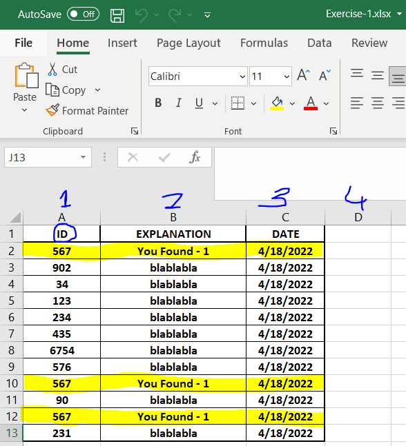
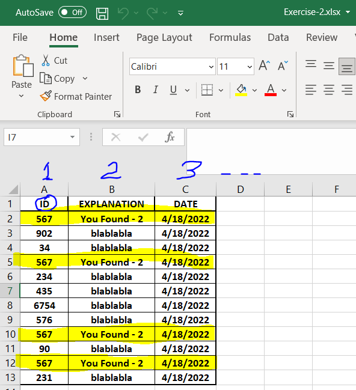
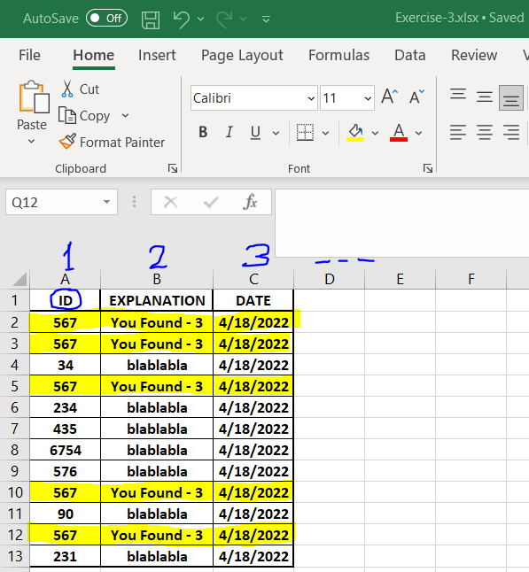

# SEARCHING ROW AND COPYING ITS COLUMNS
- This script is used for that searches and finds the searched keyword in the given column and copies the entire row to the newly created excel file. It performs this operation for all excel files in the directory which is same with directory of script. 

# Usage Example With Screenshots
- 
- 
- 
- 
- 